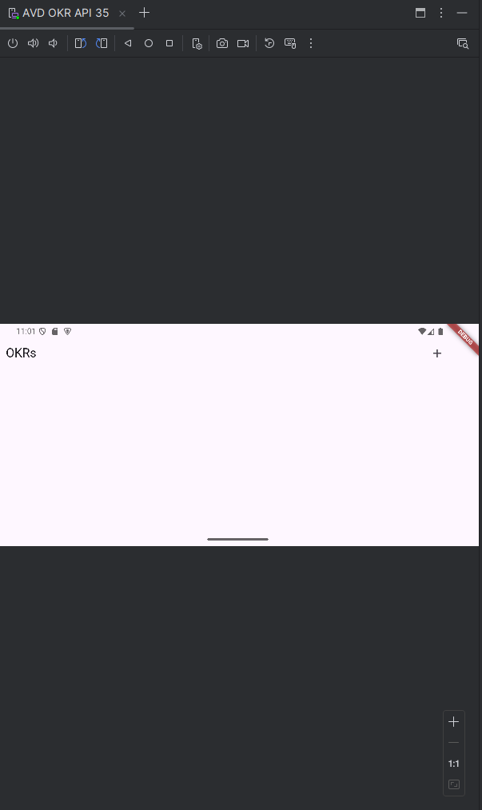
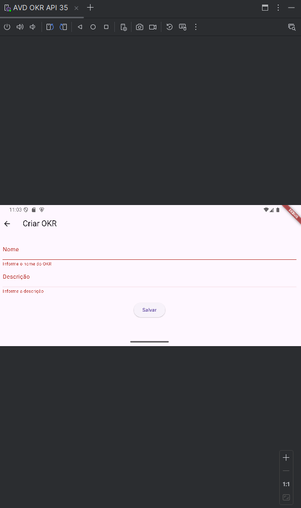
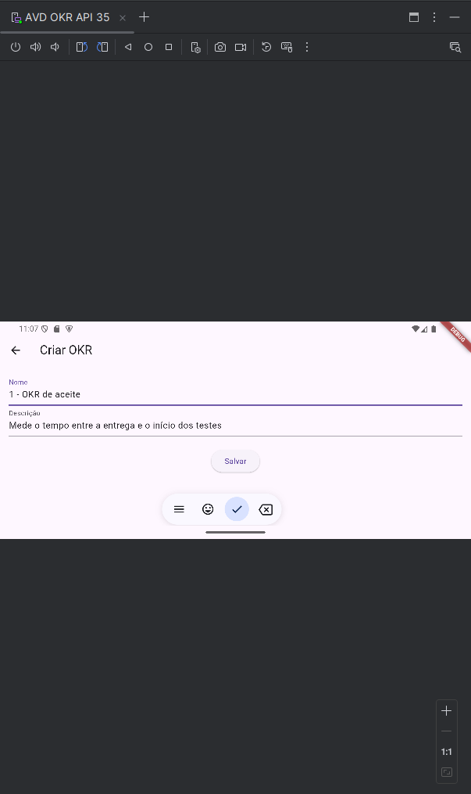
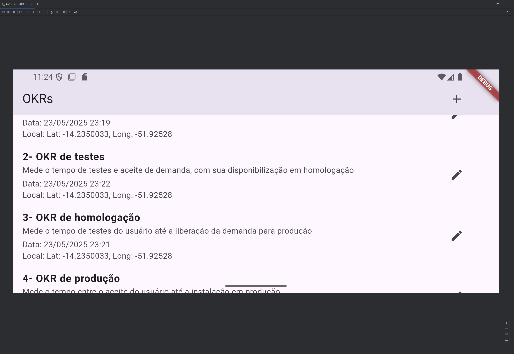
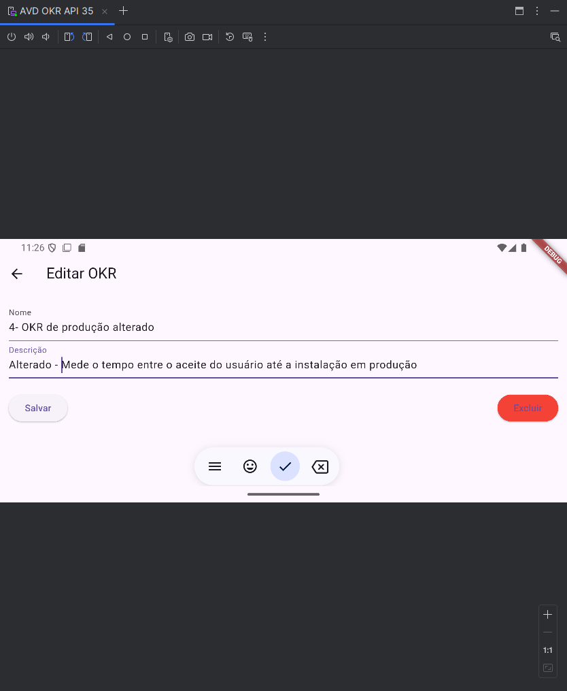
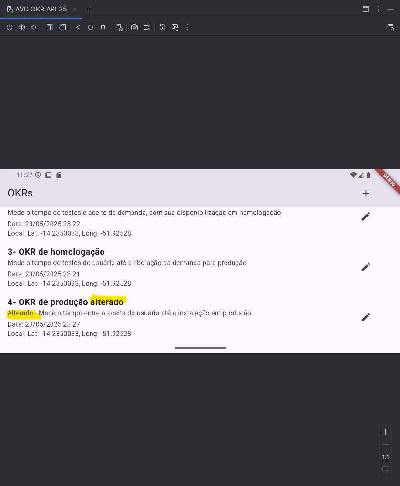
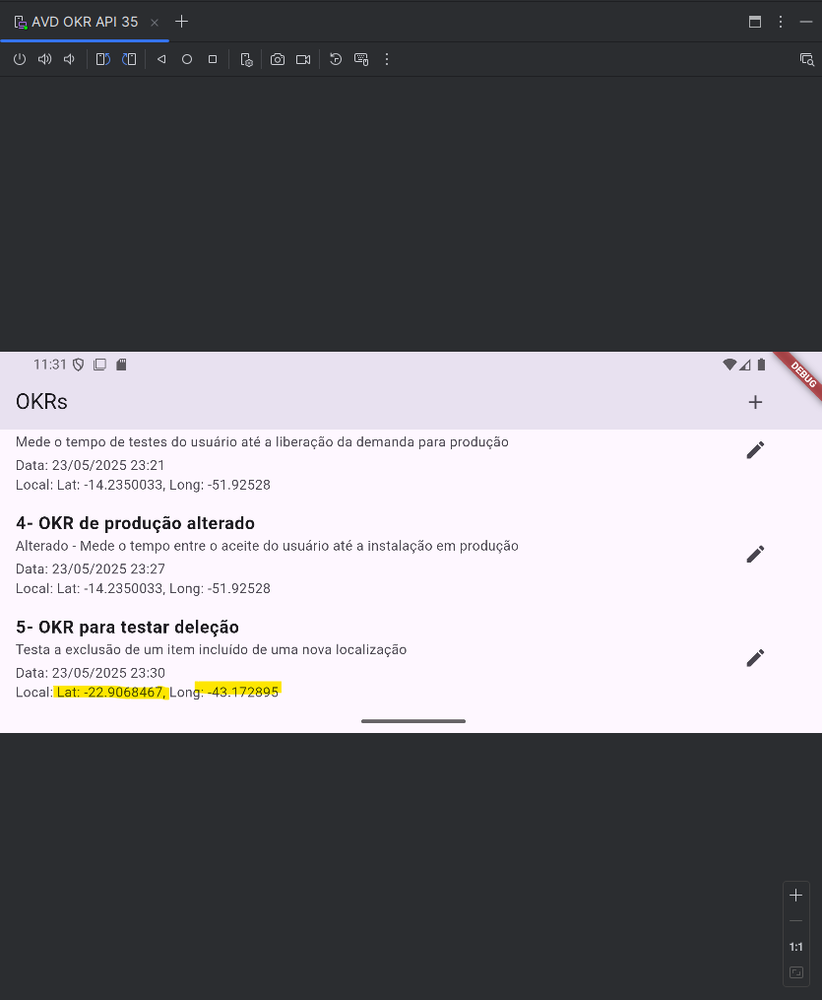
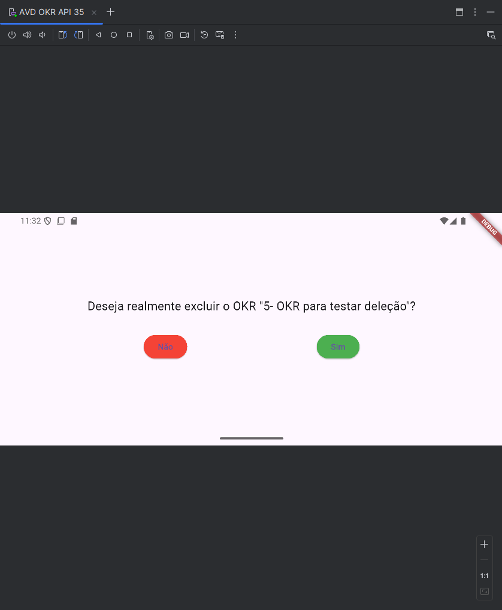
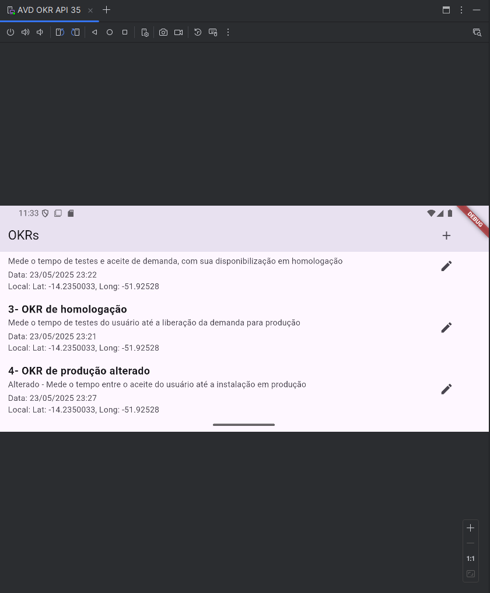

# Controle de OKRs para manutenção

## Funcionamento da aplicação

### Fluxo de inclusão de pé: Clicar no adicionar na tela inicial, clicar em salvar sem nada preenchido para verificar a validação dos campos, preencher os dados do OKR, clicar em salvar e ser direcionado para tela inicial

### Fluxo de Edição de pé: Clicar no botãoo de edição do OKR 4, realizar as alterações em cima do OKR, salvar as alterações e ser direcionado para tela de inicial (pode ser utilizado o voltar na sessão superior esquerda)

### Fluxo de exclusão de pé: Através do Fluxo de inclusão, criar um novo OKR (com uma nova localização setada), clicar no botão de edição, na parte inferior direita clicar no botão de excluir, na tela de validação da exclusão clicar em sim (podendo validar a não exclusão clicando no botão "Não") e ser direcionado para tela inicial 

'

### Fluxo de inclusão deitado: Clicar no adicionar na tela inicial, clicar em salvar sem nada preenchido para verificar a validação dos campos, preencher os dados do OKR, clicar em salvar e ser direcionado para tela inicial

### Fluxo de Edição deitado: Clicar no botãoo de edição do OKR 4, realizar as alterações em cima do OKR, salvar as alterações e ser direcionado para tela de inicial (pode ser utilizado o voltar na sessão superior esquerda)

### Fluxo de exclusão deitado: Através do Fluxo de inclusão, criar um novo OKR (com uma nova localização setada), clicar no botão de edição, na parte inferior direita clicar no botão de excluir, na tela de validação da exclusão clicar em sim (podendo validar a não exclusão clicando no botão "Não") e ser direcionado para tela inicial

